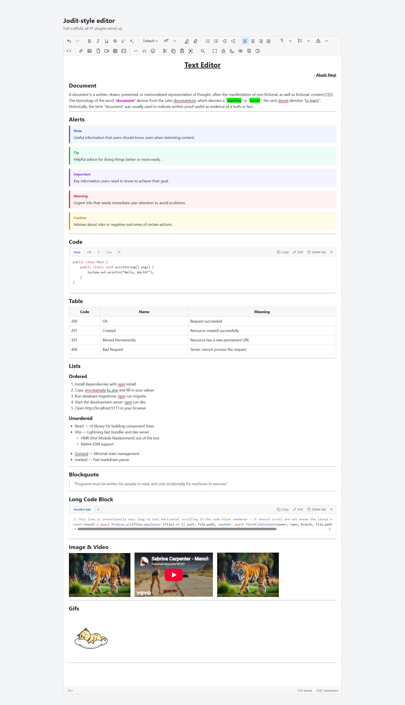

> **Development notes.** These are the original design notes from when the editor was built. They are
> not part of the published package. For installation and usage, see the [README](../README.md).

# Jodit-style editor — React, from scratch

A rich text editor built with no editor dependency — every plugin is our
own code, styled to match Jodit Editor's conventional toolbar. contentEditable
+ React, JavaScript (no TypeScript).

**One deliberate exception:** the code-block plugin uses
[highlight.js](https://highlightjs.org/) for syntax highlighting — hand-writing
grammars for a dozen-plus languages isn't a good use of "build it ourselves,"
unlike everything else in this project. It's the only runtime dependency
beyond React itself.

## Run it

```
npm install
npm run dev
```

## Demo


- Content
```
<h1 style="text-align: center; "><u>Text Editor</u></h1><div style="text-align: right; "><!--StartFragment--><b>- <u>Akash Negi</u></b><!--EndFragment--><u></u></div><h2>Document</h2><div>A <i>document</i> is a written, drawn, presented, or memorialized representation of thought, often the manifestation of non-fictional, as well as fictional, content.[1][2] The etymology of the word "<b><font color="#ff00ff">document</font></b>" derives from the Latin documentum, which denotes a "<font style="background-color: rgb(0, 255, 0);" color="#000000">teaching</font>" or "<span style="background-color: rgb(0, 255, 0);">lesson</span>": the verb doceō denotes "<u>to teach</u>". Historically, the term "document" was usually used to indicate written proof useful as evidence of a truth or fact.</div><div><hr></div><h2>Alerts</h2><div class="jc-alert jc-alert--note"><div class="jc-alert-label" contenteditable="false">Note</div><div class="jc-alert-content"><!--StartFragment-->Useful information that users should know, even when skimming content.<!--EndFragment--></div></div><div class="jc-alert jc-alert--tip"><div class="jc-alert-label" contenteditable="false">Tip</div><div class="jc-alert-content"><!--StartFragment-->Helpful advice for doing things better or more easily.<!--EndFragment--></div></div><div class="jc-alert jc-alert--important"><div class="jc-alert-label" contenteditable="false">Important</div><div class="jc-alert-content"><!--StartFragment-->Key information users need to know to achieve their goal.<!--EndFragment--></div></div><div class="jc-alert jc-alert--warning"><div class="jc-alert-label" contenteditable="false">Warning</div><div class="jc-alert-content"><!--StartFragment-->Urgent info that needs immediate user attention to avoid problems.<!--EndFragment--></div></div><div class="jc-alert jc-alert--caution"><div class="jc-alert-label" contenteditable="false">Caution</div><div class="jc-alert-content"><!--StartFragment-->Advises about risks or negative outcomes of certain actions.</div></div><hr><h2>Code</h2><div><div class="jc-code-block" contenteditable="false" data-jc-widget="code"><div class="jc-code-header">
      <div class="jc-code-tabs"><button type="button" class="jc-code-tab jc-code-tab--active" data-tab="0">Java</button><button type="button" class="jc-code-tab" data-tab="1">C#</button><button type="button" class="jc-code-tab" data-tab="2">C</button><button type="button" class="jc-code-tab" data-tab="3">C++</button><button type="button" class="jc-code-tab-add" data-action="add-tab" title="Add another file"><svg viewBox="0 0 24 24" width="13" height="13" fill="none" stroke="currentColor" stroke-width="2" stroke-linecap="round"><path d="M12 5v14M5 12h14"></path></svg></button></div>
      <div class="jc-code-actions">
        <button type="button" class="jc-code-action" data-action="copy" title="Copy code"><svg viewBox="0 0 24 24" width="13" height="13" fill="none" stroke="currentColor" stroke-width="2" stroke-linecap="round" stroke-linejoin="round"><rect width="14" height="14" x="8" y="8" rx="2" ry="2"></rect><path d="M4 16c-1.1 0-2-.9-2-2V4c0-1.1.9-2 2-2h10c1.1 0 2 .9 2 2"></path></svg><span class="jc-code-action-label">Copy</span></button>
        <button type="button" class="jc-code-action" data-action="edit" title="Edit"><svg viewBox="0 0 24 24" width="13" height="13" fill="none" stroke="currentColor" stroke-width="2" stroke-linecap="round" stroke-linejoin="round"><path d="M16.5 3.5a2.121 2.121 0 1 1 3 3L7 19l-4 1 1-4L16.5 3.5z"></path></svg><span class="jc-code-action-label">Edit</span></button>
        <button type="button" class="jc-code-action" data-action="delete-tab" title="Delete this tab"><svg viewBox="0 0 24 24" width="13" height="13" fill="none" stroke="currentColor" stroke-width="2" stroke-linecap="round" stroke-linejoin="round"><polyline points="3 6 5 6 21 6"></polyline><path d="M19 6l-1 14a2 2 0 0 1-2 2H8a2 2 0 0 1-2-2L5 6m3 0V4a2 2 0 0 1 2-2h4a2 2 0 0 1 2 2v2"></path></svg><span class="jc-code-action-label">Delete tab</span></button>
        <button type="button" class="jc-code-action jc-code-action--close" data-action="delete-block" title="Delete code block"><svg viewBox="0 0 24 24" width="13" height="13" fill="none" stroke="currentColor" stroke-width="2" stroke-linecap="round"><path d="M6 6l12 12M18 6L6 18"></path></svg></button>
      </div>
    </div>
    <div class="jc-code-panels"><div class="jc-code-panel jc-code-panel--active" data-tab="0" data-language="java" data-filename="Java" style="">
        <pre class="jc-code-pre"><code class="hljs language-java"><span class="hljs-keyword">public</span> <span class="hljs-keyword">class</span> <span class="hljs-title class_">Main</span> {
    <span class="hljs-keyword">public</span> <span class="hljs-keyword">static</span> <span class="hljs-type">void</span> <span class="hljs-title function_">main</span><span class="hljs-params">(String[] args)</span> {
        System.out.println(<span class="hljs-string">"Hello, World!"</span>);
    }
}
</code></pre>
      </div><div class="jc-code-panel" data-tab="1" data-language="csharp" data-filename="C#" style="display: none;">
        <pre class="jc-code-pre"><code class="hljs language-csharp"><span class="hljs-keyword">using</span> System;

<span class="hljs-keyword">class</span> <span class="hljs-title">Program</span> {
    <span class="hljs-function"><span class="hljs-keyword">static</span> <span class="hljs-keyword">void</span> <span class="hljs-title">Main</span>()</span> {
        Console.WriteLine(<span class="hljs-string">"Hello, World!"</span>);
    }
}
</code></pre>
      </div><div class="jc-code-panel" data-tab="2" data-language="c" data-filename="C" style="display: none;">
        <pre class="jc-code-pre"><code class="hljs language-c"><span class="hljs-meta">#<span class="hljs-keyword">include</span> <span class="hljs-string">&lt;stdio.h&gt;</span></span>

<span class="hljs-type">int</span> <span class="hljs-title function_">main</span><span class="hljs-params">()</span> {
    <span class="hljs-built_in">printf</span>(<span class="hljs-string">"Hello, World!\n"</span>);
    <span class="hljs-keyword">return</span> <span class="hljs-number">0</span>;
}
</code></pre>
      </div><div class="jc-code-panel" data-tab="3" data-language="cpp" data-filename="C++" style="display: none;">
        <pre class="jc-code-pre"><code class="hljs language-cpp"><span class="hljs-meta">#<span class="hljs-keyword">include</span> <span class="hljs-string">&lt;iostream&gt;</span></span>

<span class="hljs-function"><span class="hljs-type">int</span> <span class="hljs-title">main</span><span class="hljs-params">()</span> </span>{
    std::cout &lt;&lt; <span class="hljs-string">"Hello, World!"</span> &lt;&lt; std::endl;
    <span class="hljs-keyword">return</span> <span class="hljs-number">0</span>;
}
</code></pre>
      </div></div></div><hr><h2>Table</h2></div><div><table style="border-collapse: collapse; width: 100%;"><tbody><tr><th style="border: 1px solid rgb(209, 213, 219); padding: 6px 8px; background: rgb(247, 247, 248);">Code</th><th style="border: 1px solid rgb(209, 213, 219); padding: 6px 8px; background: rgb(247, 247, 248);">Name</th><th style="border: 1px solid rgb(209, 213, 219); padding: 6px 8px; background: rgb(247, 247, 248);">Meaning</th></tr><tr><td style="border: 1px solid rgb(209, 213, 219); padding: 6px 8px;">200</td><td style="border: 1px solid rgb(209, 213, 219); padding: 6px 8px;">Ok</td><td style="border: 1px solid rgb(209, 213, 219); padding: 6px 8px;"><!--StartFragment-->Request succeeded<!--EndFragment--></td></tr><tr><td style="border: 1px solid rgb(209, 213, 219); padding: 6px 8px;">201</td><td style="border: 1px solid rgb(209, 213, 219); padding: 6px 8px;">Created</td><td style="border: 1px solid rgb(209, 213, 219); padding: 6px 8px;">Resource created successfully</td></tr><tr><td style="border: 1px solid rgb(209, 213, 219); padding: 6px 8px;">301</td><td style="border: 1px solid rgb(209, 213, 219); padding: 6px 8px;">Moved Permanently</td><td style="border: 1px solid rgb(209, 213, 219); padding: 6px 8px;">Resource has a new permanent URL</td></tr><tr><td style="border: 1px solid rgb(209, 213, 219); padding: 6px 8px;">400</td><td style="border: 1px solid rgb(209, 213, 219); padding: 6px 8px;">Bad Request</td><td style="border: 1px solid rgb(209, 213, 219); padding: 6px 8px;">Server cannot process the request</td></tr></tbody></table><hr><h2>Lists</h2></div><h3>Ordered</h3><div><div><ol><li>Install dependencies with npm install</li><li>Copy .env.example to .env and fill in your values</li><li>Run database migrations: npm run migrate</li><li>Start the development server: npm run dev</li><li>Open http://localhost:5173 in your browser</li></ol></div></div><h3>Unordered</h3><div><div><ul><li>React — UI library for building component trees</li><li>Vite — Lightning-fast bundler and dev server<ul><li>HMR (Hot Module Replacement) out of the box</li><li>Native ESM support</li></ul></li><li>Zustand — Minimal state management</li><li>marked — Fast markdown parser</li></ul><div><hr><h2>Blockquote</h2></div></div><blockquote>"Programs must be written for people to read, and only incidentally for machines to execute."</blockquote><hr><h2>Long Code Block</h2></div><div><div class="jc-code-block" contenteditable="false" data-jc-widget="code"><div class="jc-code-header">
      <div class="jc-code-tabs"><button type="button" class="jc-code-tab jc-code-tab--active" data-tab="0">JavaScript</button><button type="button" class="jc-code-tab-add" data-action="add-tab" title="Add another file"><svg viewBox="0 0 24 24" width="13" height="13" fill="none" stroke="currentColor" stroke-width="2" stroke-linecap="round"><path d="M12 5v14M5 12h14"></path></svg></button></div>
      <div class="jc-code-actions">
        <button type="button" class="jc-code-action" data-action="copy" title="Copy code"><svg viewBox="0 0 24 24" width="13" height="13" fill="none" stroke="currentColor" stroke-width="2" stroke-linecap="round" stroke-linejoin="round"><rect width="14" height="14" x="8" y="8" rx="2" ry="2"></rect><path d="M4 16c-1.1 0-2-.9-2-2V4c0-1.1.9-2 2-2h10c1.1 0 2 .9 2 2"></path></svg><span class="jc-code-action-label">Copy</span></button>
        <button type="button" class="jc-code-action" data-action="edit" title="Edit"><svg viewBox="0 0 24 24" width="13" height="13" fill="none" stroke="currentColor" stroke-width="2" stroke-linecap="round" stroke-linejoin="round"><path d="M16.5 3.5a2.121 2.121 0 1 1 3 3L7 19l-4 1 1-4L16.5 3.5z"></path></svg><span class="jc-code-action-label">Edit</span></button>
        <button type="button" class="jc-code-action" data-action="delete-tab" title="Delete this tab"><svg viewBox="0 0 24 24" width="13" height="13" fill="none" stroke="currentColor" stroke-width="2" stroke-linecap="round" stroke-linejoin="round"><polyline points="3 6 5 6 21 6"></polyline><path d="M19 6l-1 14a2 2 0 0 1-2 2H8a2 2 0 0 1-2-2L5 6m3 0V4a2 2 0 0 1 2-2h4a2 2 0 0 1 2 2v2"></path></svg><span class="jc-code-action-label">Delete tab</span></button>
        <button type="button" class="jc-code-action jc-code-action--close" data-action="delete-block" title="Delete code block"><svg viewBox="0 0 24 24" width="13" height="13" fill="none" stroke="currentColor" stroke-width="2" stroke-linecap="round"><path d="M6 6l12 12M18 6L6 18"></path></svg></button>
      </div>
    </div>
    <div class="jc-code-panels"><div class="jc-code-panel jc-code-panel--active" data-tab="0" data-language="javascript" data-filename="JavaScript">
        <pre class="jc-code-pre"><code class="hljs language-javascript"><span class="hljs-comment">// This line is intentionally very long to test horizontal scrolling in the code block renderer — it should scroll and not break the layout of the page at all.</span>
<span class="hljs-keyword">const</span> result = <span class="hljs-keyword">await</span> <span class="hljs-title class_">Promise</span>.<span class="hljs-title function_">all</span>(files.<span class="hljs-title function_">map</span>(<span class="hljs-title function_">async</span> (file) =&gt; ({ <span class="hljs-attr">path</span>: file.<span class="hljs-property">path</span>, <span class="hljs-attr">content</span>: <span class="hljs-keyword">await</span> <span class="hljs-title function_">fetchFileContent</span>(owner, repo, branch, file.<span class="hljs-property">path</span>), <span class="hljs-attr">type</span>: <span class="hljs-title function_">getFileType</span>(file.<span class="hljs-property">path</span>) })))</code></pre>
      </div></div></div><hr><h2>Image &amp; Video</h2>&nbsp; &nbsp;&nbsp;<iframe src="https://www.youtube.com/embed/aSugSGCC12I" width="293" height="165" allowfullscreen="" data-original-url="https://www.youtube.com/watch?v=aSugSGCC12I" style="border: 0px;" class="jc-media--sized"></iframe>&nbsp; &nbsp;&nbsp;<br></div><div><hr><h2>Gifs</h2><p style="text-align: left;">&nbsp; &nbsp;&nbsp;<br></p><hr><p style="text-align: right;"><b></b></p><br><p><br></p></div>
```

## How it's put together

```
src/
  core/                 the engine — none of this is React-UI-specific
    EditorContext.jsx     ties selection + commands + history together, exposes the editor API
    SelectionManager.js   save/restore the Range so toolbar clicks don't lose your selection
    CommandRegistry.js    hybrid dispatcher: execCommand for native formatting, custom handlers for the rest
    HistoryManager.js     our own debounced undo/redo stack, independent of the browser's
    IconStore.js / icons.js / palette.js   name -> SVG lookup, the icon set, the shared color palette
    themeStorage.js         reads/writes the light-dark preference (localStorage, falls back to prefers-color-scheme)
    hljsTheme.js             swaps the injected highlight.js theme file to match (see "Theming" below)
    domUtils.js            span/style helpers for font-size, line-height; caret-placement-after-insert and URL-safety helpers shared by every insert-* popup
    findReplace.js         text-node-safe search & replace, with match-case + returns match elements
    tableUtils.js          insert/delete row & column, merge, split, align, color, column resize
    codeBlockDom.js         builds/manipulates the code-block widget (plain DOM, not React — see below)
    highlight.js            thin wrapper around highlight.js's "common" language bundle
    printUtils.js            shared print helper (waits for images to load first)

  components/            toolbar primitives + shell (all UI, no formatting logic)
    Editor.jsx, EditorCore.jsx, Toolbar.jsx, TableTools.jsx, StatusBar.jsx, Modal.jsx, SourceView.jsx
    ToolbarButton.jsx, ToolbarButtonGroup.jsx, ToolbarDropdown.jsx, ColorPicker.jsx, TableColorPopup.jsx, PopupTrigger.jsx
    popups/               form contents for link/image/file/video/table/special-char/find-replace/insert-code/about/preview

  plugins/                one file (or .jsx, if it needs markup) per feature — see index.js for the toolbar order
```

## Adding a plugin

Every plugin is a plain object:

```js
export default {
  name: 'bold',
  commands: { /* optional: name -> (editor, value) => {...}, for custom logic */ },
  button: {                // optional — omit entirely for a commands-only plugin (see tableTools.js)
    type: 'toggle' | 'instant' | 'dropdown' | 'buttonGroup' | 'colorpicker' | 'popup',
    icon: 'bold',           // looked up in core/icons.js
    tooltip: 'Bold',
    isActive: (editor) => editor.queryState('bold'),
    onClick: (editor) => editor.exec('bold'),
  },
};
```

Drop the file in `src/plugins/` (`.jsx` if `renderPopup` or similar returns
markup — Vite only parses JSX in files with that extension), add its icon
to `core/icons.js` if it's new, import it in `src/plugins/index.js`, and
add it to `row1` or `row2` wherever you want it (or `SEPARATOR` for a
divider). `about` is deliberately last in `row2` — new row-2 plugins
should go before it, not after.

## A StrictMode bug worth knowing about if you add more plugins with init()

`codeBlock.jsx` was broken for a while — tabs, edit, and delete all silently
did nothing. Root cause: `EditorContext.jsx`'s mount effect had an
`initedRef` guard so `init()` only ever ran once. React's `StrictMode`
(on by default via `main.jsx`, in dev) deliberately runs every effect as
**mount → cleanup → mount** specifically to catch bugs like this one — the
first mount's `init()` attached codeBlock's click-delegation listener, the
cleanup's `destroy()` removed it, and the guard blocked the second `init()`
from ever re-attaching it. Net effect: zero working listeners, permanently.
The fix was to remove the guard — every step in that effect is safe to run
more than once (content-loading and command registration are idempotent,
`historyRef.current.snapshotNow()` already no-ops if nothing changed) — so
`init`/`destroy` now run as a properly matched pair on every mount,
including StrictMode's synthetic one. If you add a plugin with its own
`init()`/`destroy()`, make sure the same holds: running the pair twice in a
row should leave things in exactly the state one run would.

`SourceView.jsx` had a related issue: it committed edits via the
textarea's `onBlur`, but every toolbar button (including the one that
toggles source mode off) calls `preventDefault()` on `mousedown`
specifically so clicking it doesn't steal focus from editable content —
which also means blur never fires on the textarea when you click that
button, so edits were silently discarded on toggle-off. Fixed by
committing on unmount (via the effect's cleanup function) instead, which
fires no matter how you leave source mode.

## Export to PDF

Not a separate PDF pipeline — `plugins/exportPdf.js` reuses the same
`openPrintWindow` helper as Print (there's no standard web API to write a
PDF to disk without a library; "Save as PDF" as a print destination is the
dependency-free way to get one, and every modern browser's print dialog
offers it). A distinct button exists because not everyone knows print
doubles as PDF export. `openPrintWindow` now takes an optional title,
which becomes the suggested filename in the save dialog.

## Adding a tab to an existing code block

`core/codeBlockDom.js` exports `addTabToBlock(block, tab)` alongside
`buildCodeBlock` — the "+" button in a code block's tab bar (its own class,
`.jc-code-tab-add`, deliberately *not* `.jc-code-tab`, so it's never
miscounted by switchTab/deleteActiveTab's tab-counting logic) opens
`AddTabForm.jsx` through `editor.openPopup(...)`, called from inside the
plain-DOM click handler — a nice case of the two worlds meeting: the
widget itself is vanilla DOM, but nothing stops it from reaching back into
the React popup system when a full form genuinely is the better UI for the
job.

## A CSS specificity bug, and the actual root cause of the code-block spacing

`.jc-content pre` (a generic rule, specificity: one class + one type) was
silently beating `.jc-code-pre` (specificity: one class only) on every
overlapping property — not just margin, but background and padding too,
because it wasn't just the margin line that had greater weight, the whole
rule did. Since no other feature inserts a bare `<pre>` anymore (Code
Block was dropped from the Format Block dropdown once the dedicated code
plugin existed), that whole rule was dead weight fighting the widget's own
styling — removed outright rather than just deleting the one margin
line, since leaving the background/padding conflicts in place would have
left the same *class* of bug only partly fixed. The per-tab filename label
that was also adding unwanted space is gone from the DOM entirely now
(not just hidden) — `.jc-code-panel` keeps a `data-filename` attribute
instead, which Preview and Print read via a CSS `::before` to label
stacked tabs, with no footprint in the live editor at all.

## The "View content in HTML output" regression — traced properly this time

This one actually got *worse* on the previous fix, so it's worth writing
down precisely. Switching into source mode unmounts `EditorCore` and
mounts `SourceView` in the very same render. React nulls a ref the instant
the element holding it is removed — synchronously, during commit, before
any effect runs. `SourceView`'s own mount effect calling `editor.getHTML()`
therefore read `containerRef.current` *after* it was already null, got an
empty string, and (worse) that empty string then got committed back on
the next mode switch, silently wiping content that undo had to recover.
The fix: `EditorContext`'s `changeMode` captures `getHTML()` synchronously,
in the same click-handler tick, *before* calling `setMode` — while
`EditorCore` is still mounted and the ref is still good — and stores it
in `sourceContentRef`. `SourceView` reads that captured value instead of
calling `getHTML()` itself. Verified with an actual React render (React
Testing Library + jsdom, wrapped in `StrictMode` to match dev conditions)
rather than reasoning alone, given the last fix here was wrong — 11
assertions covering entry, edit, exit, and a second no-op round-trip.

## Lock

`plugins/lock.js` toggles `editor.locked`, which `EditorCore` reflects
straight onto its own `contentEditable` prop — flipping a boolean
attribute on the same persistent DOM node, not touching its (uncontrolled)
children, so it's safe alongside the "never re-render content from state"
rule the rest of the core follows. The toolbar stays fully visible and
usable while locked, matching "the editor will remain same" — nested
widgets like code-block buttons aren't separately disabled, since
`contenteditable` only governs native rich-text editing, not click
handlers on child elements.

## Alerts

`plugins/alert.js` + `core/alertUtils.js` — GitHub-flavored-markdown-style
admonitions (Note/Tip/Important/Caution/Warning), structurally the same
as a blockquote (a container you keep typing normal content into) with a
type-specific left border/background and a fixed, non-editable label
instead of the plain grey line a quote gets.

## Not built yet, on purpose

Markdown output view was flagged as **future** work, not asked for this
round — noted here so it doesn't get lost, not implemented. (Light/dark
theming *was* picked up since — see below.)

## Theming

Every color in `editor.css` is a `--jc-*` custom property, not a literal
value — `.jc-root` defines the light (default) set and
`.jc-root[data-theme='dark']` overrides them; nothing else in the file
needs to know dark mode exists, it's just reading a variable either way.
`plugins/theme.js` flips `data-theme` and persists the choice
(`core/themeStorage.js`; falls back to `prefers-color-scheme`, then light).

Two things that *aren't* just variables, because they aren't CSS at all:

- **Code syntax highlighting.** highlight.js's theme is its own stylesheet
  full of literal colors (`.hljs-keyword`, ...) — swapping it is
  `core/hljsTheme.js` replacing the contents of a `<style>` tag it owns
  with either theme's file (imported as raw text via Vite's `?inline`),
  driven by a `useLayoutEffect` in `EditorContext` so it happens before
  paint, not after (no flash of the wrong theme on load or on toggle).
- **Print / PDF.** `printUtils.js` reuses `editor.css` wholesale (see
  "Export to PDF" below) inside a *separate document* that has no
  `.jc-root` element at all — just `<body class="jc-content">`. The
  variables are therefore also defined on `:root`, not only `.jc-root`,
  specifically so that document still has something to resolve
  `var(--jc-bg)` etc. against. Print never sets `data-theme`, so it
  always renders light regardless of the live editor's current theme —
  deliberately: dark mode is a screen-reading preference, not something
  you generally want fighting your printer's ink budget.

One thing that *is* just a variable, but still needs calling out: table
headers pasted in from elsewhere very commonly carry their own inline
`background` (almost always a light tint — the standard convention from
Word, Docs, GitHub, etc.) with no inline `color`, relying on the
browser's default black text for contrast against it. That default text
color is exactly what `--jc-text` overrides application-wide in dark
mode, so the pairing — an inline light background the theme can't touch,
plus the theme's own text gone light too — lands on light-on-light.
`.jc-content th[style*="background"]` gets a fixed dark ink color in
dark mode specifically to cover this (content that also brings its own
inline `color` is unaffected, since inline still wins there); headers
with no styling of their own still just follow the theme normally.

## Emoji

`plugins/emoji.jsx` mirrors the special-character picker's insertion
pattern exactly (`components/popups/EmojiPickerForm.jsx`) — same
`execCommand('insertText', ...)` + re-save-selection approach, so multiple
picks in a row land one after another instead of piling up in the same
spot. Layered on top: a search box (matches against a plain-English name
per emoji, not just the glyph) and category tabs. Curated (~180 entries
across 6 categories), not the full Unicode emoji set — same reasoning as
the special-character grid already in this file: a toolbar picker doesn't
need 1000+ entries with every skin-tone/gender variant to be useful.

## Toolbar layout

`plugins/index.js` exports `toolbarRows` — a fixed 2D array (`[row1, row2]`),
not a flat list, and `Toolbar.jsx` renders it as two independent rows. Row 1
is formatting (undo → line height), row 2 is insert/utility (link → about).
A button's position is tied to which row it's listed in, not recomputed from
available width, so it doesn't reshuffle between normal and full screen —
each row still wraps normally (plain `flex-wrap: wrap`) if it doesn't fit,
it just wraps within its own fixed set of buttons rather than mixing rows.

`allPlugins` (also exported from `plugins/index.js`) is the flattened list,
plus button-less plugins like `tableTools` — that's what `<Editor plugins={...}>`
uses to register commands and run `init()`, separately from what the
toolbar displays.

Both rows share one `gap` value (now 4px, up from an original 2px), but
it reads very differently between them: row 1's dropdowns and grouped
controls are wide enough to add their own visual breathing room on top
of whatever the gap is, while row 2 is almost entirely same-size 28px
icon buttons back to back with nothing else to break up the rhythm — so
the exact same gap value looked noticeably tighter there. 4px was picked
by comparing a few values directly against row 2's longest unbroken
runs of plain buttons (the six insert-* icons, and the seven utility
icons at the end); it's sized to fix that without pushing row 1 wide
enough to wrap at normal widths.

## Table editing

Insert/delete row or column, merge with the cell to the right or below,
split a merged cell back apart, per-cell background/text/border color,
cell text alignment, empty a cell, toggle header row, delete table, and
drag-to-resize columns — all live in a floating popup, `TableTools.jsx`,
that appears attached to the table itself (like Jodit's own inline-popup),
not a bar pinned to the top of the editor. It repositions when you move to
a different table or resize the window; scrolling moves it for free since
it's an absolutely-positioned child of the scrolling content area. Column
resize handles are separate small overlays along the table's first row,
not injected into the table's own DOM, so they never pollute the saved HTML.

Merge/split logic in `core/tableUtils.js` is colspan/rowspan-aware (verified
with an actual merge → split round-trip test, not just simple grids). Split
only does something on a cell that already spans more than one column/row —
it's the direct inverse of merge, the same relationship Word/Excel use.
Deeply irregular *pre-existing* spans (from HTML pasted in from elsewhere,
say) aren't guaranteed to come out perfectly — the visual-column-index math
assumes the table was built by this editor's own tools.

## Color

Text color and background color are one button (`plugins/color.js`), not
two — a tabbed popup (Text / Background) picks which one a click applies
to, with a 40-swatch palette plus a native color input for anything outside
it. Table cells get their own version with a third tab (`TableColorPopup.jsx`,
Background / Text / Border) since a cell can reasonably want a border color
independent of the page's text-selection color.

## Code blocks

`plugins/codeBlock.jsx` inserts a widget — single code block or multi-tab —
built in `core/codeBlockDom.js`. It's plain DOM (`document.createElement`
and friends), not React: the widget lives inside the contentEditable content
itself (`contenteditable="false"` on the wrapper, so the browser's native
rich-text editing doesn't mangle it), so its copy/edit/delete/tab buttons
are wired up with **one delegated click listener** on the editor root,
attached once via the plugin's `init()` hook — not per-button React
handlers, since these buttons aren't React elements. Editing a tab swaps its
highlighted `<pre><code>` for a plain `<textarea>` and re-highlights on
save; a `<textarea>` is fully editable regardless of the wrapper's
`contenteditable="false"`, since that attribute only governs the browser's
own rich-text editing, not form controls.

Preview and Print both override code-block styling: the interactive
buttons and tab switcher are hidden, and every tab's panel is forced
visible and stacked instead of only the active one — there's nothing to
click through in read-only output anyway.

## Status bar

Alongside the live word/character count, the status bar shows a clickable
tag-path breadcrumb (`body > p > strong`) for wherever the caret is — the
same idea as Jodit's `showXPathInStatusbar` option. Clicking a segment
selects that element.

## Caret position after insert — link/image/file/video/table/code/alert

The single most consequential bug found in the last review pass: every
insert-* popup builds its element, then does either `range.insertNode(el)`
or `range.surroundContents(el)` on what was a *collapsed* selection.
Per spec, that does not leave the caret after the inserted node — the
range's end moves to just past it, but its start stays where it was, so
the range ends up *spanning the whole node* instead of collapsing past
it. Nothing syncs that back to the live selection on its own, and since
these popups already re-focus the editor root right before inserting
(`editor.selection.restore()`), focus stays put — so the very next
keystroke landed right on that now-selected node and replaced it. Insert
a link, type one more word, and the link's text was gone, overwritten by
what you typed; the same thing happened to a freshly-inserted image, an
entire table, and a code block. It reproduced consistently, not as a
timing fluke — verified with an actual headless browser (Playwright),
not just by reading the insertNode/surroundContents spec and reasoning
about it, given how easy it is to get selection edge cases wrong on paper.

Fixed with two small shared helpers in `core/domUtils.js`:
`placeCaretAfter(editor, node)` collapses the caret to just after a node
(link, image, download link, video embed — things you keep typing normal
prose after), and `placeCaretInside(editor, container)` collapses it to
the end of a container's own contents (an alert's body, a table's first
cell, the empty paragraph `InsertCodeForm` already left after a code
block for exactly this reason — it just wasn't being moved into
automatically before). Every insert-* popup calls one of these
immediately after inserting.

Fixing this surfaced a second, narrower bug in `alertUtils.js`:
`getBlockAncestor()` matches the nearest `<div>`, and an alert's own
content is a `<div>` — so with the caret now routinely left *inside* a
just-inserted alert (by design, per above), inserting a *second* alert
right after the first resolved "the block to wrap" to the first alert's
own content div, nesting the new alert inside it and losing whatever
that div's replaced content wasn't carrying over. Fixed by having
`insertAlert` check for an enclosing `.jc-alert` first and, if one exists,
add the new alert as a sibling right after it instead of wrapping
whatever's inside it.

## Undo/redo vs. the browser's own

Ctrl+Z/Ctrl+Y weren't handled anywhere in this app's own code, which
meant they fell straight through to the browser's native contentEditable
undo manager — a completely separate history from `HistoryManager`
(see "Kept deliberately separate from `document.execCommand('undo')`" at
the top of that file). The two don't know about each other: native undo
has no idea a table edit, code-block change, or alert insertion
happened, since none of those go through `execCommand`; this app's stack
has no idea a native undo just happened, since that mutates the DOM
without going through `editor.history` at all — it just sees new content
on the next `input` event and pushes it as a brand new forward entry
rather than rewinding. Reproduced concretely: type something, press
Ctrl+Z (removes it, via native undo), then click the toolbar's own Undo
button — which, because its stack still had the pre-Ctrl+Z state sitting
one step back, *brought the removed text back*. Confusing and, for a
tool whose whole job is not losing your document, a real problem.

Fixed in `EditorCore.jsx`: a `keydown` handler intercepts Ctrl/Cmd+Z and
Ctrl/Cmd+Shift+Z (or +Y), calls `preventDefault()`, and routes both
straight to `editor.history.undo()/redo()`. Native contentEditable undo
never runs at all now — there's exactly one history system, always.

Separately, `HistoryManager`'s debounced auto-snapshot (the one that
turns a whole burst of typing into a single history entry 400ms after
you stop) had no way to tell React a render was due once it actually
fired — nothing else was listening for it. The toolbar's Undo/Redo
buttons could sit stale (e.g. still disabled right after typing, since
the debounce that would have enabled them hadn't resolved yet at render
time) until some unrelated event happened to re-render the toolbar.
Fixed by giving the constructor an `onChange` callback, invoked at the
end of `snapshotNow()` — wired to the same `bump()` every other mutation
already calls.

## Content safety for the database round-trip

This editor's own stated use case — extract the HTML, save it, and later
load it back in from a database to render again — means the boundary
where content *enters* the editor from outside its own live DOM matters
architecturally, not just as a one-off concern. Two gaps, found by
actually trying them rather than just reading the relevant code:

- **Insert Link/File/Image/Video accepted any URL verbatim**, including
  `javascript:alert(document.domain)` typed straight into the URL field.
  Confirmed live: the editor happily produced
  `<a href="javascript:alert(...)">`. Since the whole point is that this
  HTML gets saved and re-rendered for other people later, that's a
  stored-XSS path opened by the insert-link *form itself*, no paste or
  database tampering required. Fixed with `isSafeUrl`/`isSafeImageSrc`
  in `core/domUtils.js` — a conservative allowlist (http(s)/mailto/tel,
  plus schemeless relative/anchor/query URLs; `data:image/*` too for
  images, matching how pasted images already get embedded) rather than a
  blocklist, since new dangerous schemes are easier to invent than to
  enumerate. Insert Video's YouTube/Vimeo iframe path was already
  host-restricted and didn't need this; its direct-video-file fallback
  did. Rejection shows an inline `.jc-form-error` message instead of
  silently doing nothing.
- **Nothing sanitized HTML on the way into the editor** — not the
  initial value it's mounted with, not `editor.setHTML()` (used by
  undo/redo and by committing out of source-view), not the toolbar's
  clipboard-based Paste button. All three now go through
  `core/sanitize.js`, a deliberately narrow pass — it does *not* touch
  tags, classes, or most attributes, since this editor's own widgets
  (code blocks, alerts) depend on a wide set of structural markup
  (`data-*`, `contenteditable="false"`, inline SVG, `<button>`) that a
  strict allowlist sanitizer would have to special-case anyway, and
  getting that allowlist wrong would silently corrupt legitimate saved
  documents — for a document-management tool, its own kind of serious
  bug. Instead it strips only what's unambiguously dangerous and never
  editor-generated: `<script>` elements outright, every `on*`
  event-handler attribute, `javascript:`/`vbscript:` URIs in
  href/src/action, and `<iframe>`s pointing anywhere other than the
  YouTube/Vimeo hosts the video plugin itself ever produces. Verified
  both as isolated unit cases (script tags, `onerror`, arbitrary
  iframes stripped; YouTube/Vimeo embeds, `data:image/*`, and a full
  code-block/alert/table's worth of real widget markup all preserved
  byte-for-byte) and end-to-end through an actual mount with a
  realistic document — including confirming the loaded content stayed
  fully interactive afterward (e.g. switching code-block tabs still
  worked).
  Native Ctrl+V paste deliberately still isn't intercepted (see "Paste
  button" below) — sanitizing that too would mean rewriting how paste
  works generally, a materially bigger and riskier change than closing
  the gaps above, and the load-time sanitizer already covers the
  boundary this app's own use case actually described: what happens
  when previously-saved content — regardless of how it was originally
  authored — gets rendered again.

## What's fully working vs. simplified

Toggle/instant formatting, the dropdowns, table editing (including
merge/split/resize/color), find & replace (match case, next/previous
navigation), insert-link/image/file/video/table/code (including adding
tabs to an existing code block), Preview, Lock, Alerts, light/dark
theming, the emoji picker, and the status bar all do the real thing. A
few things are intentionally simplified — worth knowing about before you
rely on them:

- **Paste button** — checks the clipboard for an image first, then rich
  HTML, then falls back to plain text (Chrome blocks `execCommand('paste')`
  outright, so the button goes through the async Clipboard API instead;
  Ctrl+V works fully and natively either way, no code needed for that
  path — see "Content safety for the database round-trip" above for why
  that's still true even after this pass). The rich-HTML branch now runs
  through `sanitizeHtml()` before inserting, same as everything else that
  brings outside content in.
- **Find & replace** — substring match (with an optional case-sensitivity
  toggle), not regex/whole-word.
- **Special characters** — a curated ~55-character grid, not a full Unicode browser.
- **Merge/split** — handles cells with no more than one level of pre-existing
  span cleanly; very irregular tables (e.g. pasted from elsewhere) aren't
  guaranteed a perfect result.
- **Table popup positioning** — recomputes on table change and window resize;
  doesn't yet clamp to the viewport if the table scrolls mostly out of view.
- **Code-block Edit/Delete** — act on whichever tab is currently active, not
  a specific tab you click on independent of switching to it first.
- **Lock** — governs the main content area's editability; doesn't separately
  disable nested widget buttons (code-block copy/edit/delete still respond,
  since `contenteditable` only governs native rich-text editing, not click
  handlers).

None of these are architectural limits — each is a single function in
`src/plugins/` or `src/core/` that can be swapped for a fuller
implementation without touching anything else.

Removed along the way: **Paint Format** (redundant with Text/Background
color once those had distinct icons — now merged into one color picker
anyway) and **Classname** (not useful enough to keep). "Code block" was
also dropped from the Format Block dropdown (there's a dedicated code
plugin now).

---

### Editor
```
<p><font color="#000000" face="Mona Sans VF, -apple-system, BlinkMacSystemFont, Segoe UI, Noto Sans Backtick Fix, Noto Sans, Helvetica, Arial, sans-serif, Apple Color Emoji, Segoe UI Emoji"><span style="font-size: 18px; font-weight: normal;"></span></font></p><h1 style="font-size: 14px;"><font color="#000000" face="Mona Sans VF, -apple-system, BlinkMacSystemFont, Segoe UI, Noto Sans Backtick Fix, Noto Sans, Helvetica, Arial, sans-serif, Apple Color Emoji, Segoe UI Emoji"><span style="font-size: 18px;"><span style="font-size: 24px;">👋 Building Better Editing Experiences</span></span><span style="font-size: 18px; font-weight: normal;">&nbsp;</span></font></h1><p style="font-size: 14px;"><font color="#000000" face="Mona Sans VF, -apple-system, BlinkMacSystemFont, Segoe UI, Noto Sans Backtick Fix, Noto Sans, Helvetica, Arial, sans-serif, Apple Color Emoji, Segoe UI Emoji"><span style="font-size: 18px; font-weight: normal;">Modern web applications demand rich text editing that feels native and intuitive. Whether you're building a CMS, an email composer, or a <span style="background-color: rgb(255, 255, 0);">documentation platform</span> — the editor is where your users spend most of their time.&nbsp;</span></font></p><p style="font-size: 14px;"><font face="Mona Sans VF, -apple-system, BlinkMacSystemFont, Segoe UI, Noto Sans Backtick Fix, Noto Sans, Helvetica, Arial, sans-serif, Apple Color Emoji, Segoe UI Emoji"><span style="font-size: 18px;"><font color="#000000" style="font-weight: normal;">That's why we built this Editor with </font><font color="#ff00ff" style=""><b><i><u>JavaScript</u></i></b>&nbsp;</font><font color="#000000" style="font-weight: normal;">from the ground up: <span style="background-color: rgb(0, 255, 0);">zero dependencies</span>, full control over every button, dialog and behavior. The result is an editor that's fast to load, simple to configure and easy to extend.</font></span></font></p><hr style="font-size: 14px;"><h1 style=""><font color="#000000" face="Mona Sans VF, -apple-system, BlinkMacSystemFont, Segoe UI, Noto Sans Backtick Fix, Noto Sans, Helvetica, Arial, sans-serif, Apple Color Emoji, Segoe UI Emoji"><span style="font-size: 18px;"><u>Video</u></span></font></h1><p style="font-size: 14px;"><font color="#000000" face="Mona Sans VF, -apple-system, BlinkMacSystemFont, Segoe UI, Noto Sans Backtick Fix, Noto Sans, Helvetica, Arial, sans-serif, Apple Color Emoji, Segoe UI Emoji"><span style="font-size: 18px; font-weight: normal;">&nbsp;&nbsp;<iframe src="https://www.youtube.com/embed/V9vuCByb6js" width="560" height="315" allowfullscreen="" style="border: 0px;"></iframe><br></span></font></p><p><font color="#000000" face="Mona Sans VF, -apple-system, BlinkMacSystemFont, Segoe UI, Noto Sans Backtick Fix, Noto Sans, Helvetica, Arial, sans-serif, Apple Color Emoji, Segoe UI Emoji"><span style="font-size: 18px; font-weight: normal;"></span></font></p><font face="Mona Sans VF, -apple-system, BlinkMacSystemFont, Segoe UI, Noto Sans Backtick Fix, Noto Sans, Helvetica, Arial, sans-serif, Apple Color Emoji, Segoe UI Emoji" color="#000000"><hr><h1 style="font-size: 16px;"><span style="font-size: 16px;"><u>Alerts</u></span></h1><div class="jc-alert jc-alert--note" style="font-size: 16px;"><div class="jc-alert-label" contenteditable="false">Note</div><div class="jc-alert-content">This is a note alert. It supports inline code, bold, and italic text inside.</div></div></font><div class="jc-alert jc-alert--tip"><div class="jc-alert-label" contenteditable="false">Tip</div><div class="jc-alert-content"><div><font face="Mona Sans VF, -apple-system, BlinkMacSystemFont, Segoe UI, Noto Sans Backtick Fix, Noto Sans, Helvetica, Arial, sans-serif, Apple Color Emoji, Segoe UI Emoji" color="#000000"><span style="font-size: 16px;">Use npm run dev to start the development server. Tip alerts are great for shortcuts and best practices.</span></font></div><div><font face="Mona Sans VF, -apple-system, BlinkMacSystemFont, Segoe UI, Noto Sans Backtick Fix, Noto Sans, Helvetica, Arial, sans-serif, Apple Color Emoji, Segoe UI Emoji" color="#000000"><div></div></font></div></div></div><div><font face="Mona Sans VF, -apple-system, BlinkMacSystemFont, Segoe UI, Noto Sans Backtick Fix, Noto Sans, Helvetica, Arial, sans-serif, Apple Color Emoji, Segoe UI Emoji" color="#000000"><span style="font-size: 16px;"></span></font></div><div><font face="Mona Sans VF, -apple-system, BlinkMacSystemFont, Segoe UI, Noto Sans Backtick Fix, Noto Sans, Helvetica, Arial, sans-serif, Apple Color Emoji, Segoe UI Emoji" color="#000000"><div class="jc-alert jc-alert--important"><div class="jc-alert-label" contenteditable="false">Important</div><div class="jc-alert-content"><div><span style="font-size: 16px;"><p>Always commit your .env.example file but never commit your actual .env. This is important for security.</p></span></div><div><div></div></div></div></div><div style=""><span style="font-size: 16px;"></span></div><div style=""><div class="jc-alert jc-alert--caution"><div class="jc-alert-label" contenteditable="false">Caution</div><div class="jc-alert-content"><div><span style="font-size: 16px;">Calling this API without authentication will hit the 60 requests/hour rate limit very quickly.</span></div><div><div></div></div></div></div><div style=""><span style="font-size: 16px;"></span></div><div style=""><div class="jc-alert jc-alert--warning"><div class="jc-alert-label" contenteditable="false">Warning</div><div class="jc-alert-content"><div><span style="font-size: 16px;">Running DROP TABLE users; is irreversible. Make sure you have a backup before proceeding.</span></div><div style="font-size: 16px;"></div></div></div><div style=""><span style="font-size: 16px;"></span></div><div style=""><hr style="font-size: 16px;"><h1 style="font-size: 16px;"><u>Code Tabs</u></h1><div style=""><div class="jc-code-block" contenteditable="false" data-jc-widget="code" style="font-size: 16px;"><div class="jc-code-header">
      <div class="jc-code-tabs"><button type="button" class="jc-code-tab jc-code-tab--active" data-tab="0" fdprocessedid="h6de46">c++</button><button type="button" class="jc-code-tab" data-tab="1" fdprocessedid="by75wd">Python</button><button type="button" class="jc-code-tab" data-tab="2" fdprocessedid="uqfdba">JavaScript</button><button type="button" class="jc-code-tab" data-tab="3" fdprocessedid="uuuxwo">Java</button><button type="button" class="jc-code-tab-add" data-action="add-tab" title="Add another file" fdprocessedid="d7r5t"><svg viewBox="0 0 24 24" width="13" height="13" fill="none" stroke="currentColor" stroke-width="2" stroke-linecap="round"><path d="M12 5v14M5 12h14"></path></svg></button></div>
      <div class="jc-code-actions">
        <button type="button" class="jc-code-action" data-action="copy" title="Copy code" fdprocessedid="ou4vde"><svg viewBox="0 0 24 24" width="13" height="13" fill="none" stroke="currentColor" stroke-width="2" stroke-linecap="round" stroke-linejoin="round"><rect width="14" height="14" x="8" y="8" rx="2" ry="2"></rect><path d="M4 16c-1.1 0-2-.9-2-2V4c0-1.1.9-2 2-2h10c1.1 0 2 .9 2 2"></path></svg><span class="jc-code-action-label">Copy</span></button>
        <button type="button" class="jc-code-action" data-action="edit" title="Edit" fdprocessedid="vmj69m"><svg viewBox="0 0 24 24" width="13" height="13" fill="none" stroke="currentColor" stroke-width="2" stroke-linecap="round" stroke-linejoin="round"><path d="M16.5 3.5a2.121 2.121 0 1 1 3 3L7 19l-4 1 1-4L16.5 3.5z"></path></svg><span class="jc-code-action-label">Edit</span></button>
        <button type="button" class="jc-code-action" data-action="delete-tab" title="Delete this tab" fdprocessedid="bjfb8c"><svg viewBox="0 0 24 24" width="13" height="13" fill="none" stroke="currentColor" stroke-width="2" stroke-linecap="round" stroke-linejoin="round"><polyline points="3 6 5 6 21 6"></polyline><path d="M19 6l-1 14a2 2 0 0 1-2 2H8a2 2 0 0 1-2-2L5 6m3 0V4a2 2 0 0 1 2-2h4a2 2 0 0 1 2 2v2"></path></svg><span class="jc-code-action-label">Delete tab</span></button>
        <button type="button" class="jc-code-action jc-code-action--close" data-action="delete-block" title="Delete code block" fdprocessedid="rmgvlq"><svg viewBox="0 0 24 24" width="13" height="13" fill="none" stroke="currentColor" stroke-width="2" stroke-linecap="round"><path d="M6 6l12 12M18 6L6 18"></path></svg></button>
      </div>
    </div>
    <div class="jc-code-panels"><div class="jc-code-panel jc-code-panel--active" data-tab="0" data-language="cpp" data-filename="c++" style="">
        <pre class="jc-code-pre"><code class="hljs language-cpp"><span class="hljs-meta">#<span class="hljs-keyword">include</span> <span class="hljs-string">&lt;iostream&gt;</span></span>
<span class="hljs-keyword">using</span> <span class="hljs-keyword">namespace</span> std;

<span class="hljs-function"><span class="hljs-type">int</span> <span class="hljs-title">main</span><span class="hljs-params">()</span> </span>{
    <span class="hljs-type">int</span> a = <span class="hljs-number">10</span>, b = <span class="hljs-number">20</span>;
    cout &lt;&lt; a + b &lt;&lt; endl;
    <span class="hljs-keyword">return</span> <span class="hljs-number">0</span>;
}</code></pre>
      </div><div class="jc-code-panel" data-tab="1" data-language="python" data-filename="Python" style="display: none;">
        <pre class="jc-code-pre"><code class="hljs language-python">a = <span class="hljs-number">10</span>
b = <span class="hljs-number">20</span>
<span class="hljs-built_in">print</span>(a + b)</code></pre>
      </div><div class="jc-code-panel" data-tab="2" data-language="javascript" data-filename="JavaScript" style="display: none;">
        <pre class="jc-code-pre"><code class="hljs language-javascript"><span class="hljs-keyword">const</span> a = <span class="hljs-number">10</span>;
<span class="hljs-keyword">const</span> b = <span class="hljs-number">20</span>;
<span class="hljs-variable language_">console</span>.<span class="hljs-title function_">log</span>(a + b);</code></pre>
      </div><div class="jc-code-panel" data-tab="3" data-language="java" data-filename="Java" style="display: none;">
        <pre class="jc-code-pre"><code class="hljs language-java"><span class="hljs-keyword">public</span> <span class="hljs-keyword">class</span> <span class="hljs-title class_">Main</span> {
    <span class="hljs-keyword">public</span> <span class="hljs-keyword">static</span> <span class="hljs-type">void</span> <span class="hljs-title function_">main</span><span class="hljs-params">(String[] args)</span> {
        <span class="hljs-type">int</span> <span class="hljs-variable">a</span> <span class="hljs-operator">=</span> <span class="hljs-number">10</span>;
        <span class="hljs-type">int</span> <span class="hljs-variable">b</span> <span class="hljs-operator">=</span> <span class="hljs-number">20</span>;
        System.out.println(a + b);
    }
}</code></pre>
      </div></div></div><hr style="font-size: 16px;"><h1><span style="font-size: 16px;"><u>Syntax Highlighting</u></span></h1></div><div style=""><div class="jc-code-block" contenteditable="false" data-jc-widget="code"><div class="jc-code-header">
      <div class="jc-code-tabs"><button type="button" class="jc-code-tab jc-code-tab--active" data-tab="0" fdprocessedid="u8x7rh">TypeScript</button><button type="button" class="jc-code-tab-add" data-action="add-tab" title="Add another file" fdprocessedid="zmbbw"><svg viewBox="0 0 24 24" width="13" height="13" fill="none" stroke="currentColor" stroke-width="2" stroke-linecap="round"><path d="M12 5v14M5 12h14"></path></svg></button></div>
      <div class="jc-code-actions">
        <button type="button" class="jc-code-action" data-action="copy" title="Copy code" fdprocessedid="618tmk"><svg viewBox="0 0 24 24" width="13" height="13" fill="none" stroke="currentColor" stroke-width="2" stroke-linecap="round" stroke-linejoin="round"><rect width="14" height="14" x="8" y="8" rx="2" ry="2"></rect><path d="M4 16c-1.1 0-2-.9-2-2V4c0-1.1.9-2 2-2h10c1.1 0 2 .9 2 2"></path></svg><span class="jc-code-action-label">Copy</span></button>
        <button type="button" class="jc-code-action" data-action="edit" title="Edit" fdprocessedid="x3vwwo"><svg viewBox="0 0 24 24" width="13" height="13" fill="none" stroke="currentColor" stroke-width="2" stroke-linecap="round" stroke-linejoin="round"><path d="M16.5 3.5a2.121 2.121 0 1 1 3 3L7 19l-4 1 1-4L16.5 3.5z"></path></svg><span class="jc-code-action-label">Edit</span></button>
        <button type="button" class="jc-code-action" data-action="delete-tab" title="Delete this tab" fdprocessedid="g5iaw7"><svg viewBox="0 0 24 24" width="13" height="13" fill="none" stroke="currentColor" stroke-width="2" stroke-linecap="round" stroke-linejoin="round"><polyline points="3 6 5 6 21 6"></polyline><path d="M19 6l-1 14a2 2 0 0 1-2 2H8a2 2 0 0 1-2-2L5 6m3 0V4a2 2 0 0 1 2-2h4a2 2 0 0 1 2 2v2"></path></svg><span class="jc-code-action-label">Delete tab</span></button>
        <button type="button" class="jc-code-action jc-code-action--close" data-action="delete-block" title="Delete code block" fdprocessedid="uz4kfq"><svg viewBox="0 0 24 24" width="13" height="13" fill="none" stroke="currentColor" stroke-width="2" stroke-linecap="round"><path d="M6 6l12 12M18 6L6 18"></path></svg></button>
      </div>
    </div>
    <div class="jc-code-panels"><div class="jc-code-panel jc-code-panel--active" data-tab="0" data-language="typescript" data-filename="TypeScript">
        <pre class="jc-code-pre"><code class="hljs language-typescript"><span class="hljs-keyword">interface</span> <span class="hljs-title class_">User</span> {
  <span class="hljs-attr">id</span>: <span class="hljs-built_in">number</span>
  <span class="hljs-attr">name</span>: <span class="hljs-built_in">string</span>
  <span class="hljs-attr">email</span>: <span class="hljs-built_in">string</span>
  <span class="hljs-attr">role</span>: <span class="hljs-string">'admin'</span> | <span class="hljs-string">'user'</span> | <span class="hljs-string">'guest'</span>
}

<span class="hljs-keyword">async</span> <span class="hljs-keyword">function</span> <span class="hljs-title function_">fetchUser</span>(<span class="hljs-params"><span class="hljs-attr">id</span>: <span class="hljs-built_in">number</span></span>): <span class="hljs-title class_">Promise</span>&lt;<span class="hljs-title class_">User</span>&gt; {
  <span class="hljs-keyword">const</span> res = <span class="hljs-keyword">await</span> <span class="hljs-title function_">fetch</span>(<span class="hljs-string">`/api/users/<span class="hljs-subst">${id}</span>`</span>)
  <span class="hljs-keyword">if</span> (!res.<span class="hljs-property">ok</span>) <span class="hljs-keyword">throw</span> <span class="hljs-keyword">new</span> <span class="hljs-title class_">Error</span>(<span class="hljs-string">`HTTP <span class="hljs-subst">${res.status}</span>`</span>)
  <span class="hljs-keyword">return</span> res.<span class="hljs-title function_">json</span>() <span class="hljs-keyword">as</span> <span class="hljs-title class_">Promise</span>&lt;<span class="hljs-title class_">User</span>&gt;
}</code></pre>
      </div></div></div><p></p><div class="jc-code-block" contenteditable="false" data-jc-widget="code"><div class="jc-code-header">
      <div class="jc-code-tabs"><button type="button" class="jc-code-tab jc-code-tab--active" data-tab="0" fdprocessedid="ccud1k">Python</button><button type="button" class="jc-code-tab-add" data-action="add-tab" title="Add another file" fdprocessedid="u87kd3"><svg viewBox="0 0 24 24" width="13" height="13" fill="none" stroke="currentColor" stroke-width="2" stroke-linecap="round"><path d="M12 5v14M5 12h14"></path></svg></button></div>
      <div class="jc-code-actions">
        <button type="button" class="jc-code-action" data-action="copy" title="Copy code" fdprocessedid="oce2f"><svg viewBox="0 0 24 24" width="13" height="13" fill="none" stroke="currentColor" stroke-width="2" stroke-linecap="round" stroke-linejoin="round"><rect width="14" height="14" x="8" y="8" rx="2" ry="2"></rect><path d="M4 16c-1.1 0-2-.9-2-2V4c0-1.1.9-2 2-2h10c1.1 0 2 .9 2 2"></path></svg><span class="jc-code-action-label">Copy</span></button>
        <button type="button" class="jc-code-action" data-action="edit" title="Edit" fdprocessedid="b2414b"><svg viewBox="0 0 24 24" width="13" height="13" fill="none" stroke="currentColor" stroke-width="2" stroke-linecap="round" stroke-linejoin="round"><path d="M16.5 3.5a2.121 2.121 0 1 1 3 3L7 19l-4 1 1-4L16.5 3.5z"></path></svg><span class="jc-code-action-label">Edit</span></button>
        <button type="button" class="jc-code-action" data-action="delete-tab" title="Delete this tab" fdprocessedid="ggqu3"><svg viewBox="0 0 24 24" width="13" height="13" fill="none" stroke="currentColor" stroke-width="2" stroke-linecap="round" stroke-linejoin="round"><polyline points="3 6 5 6 21 6"></polyline><path d="M19 6l-1 14a2 2 0 0 1-2 2H8a2 2 0 0 1-2-2L5 6m3 0V4a2 2 0 0 1 2-2h4a2 2 0 0 1 2 2v2"></path></svg><span class="jc-code-action-label">Delete tab</span></button>
        <button type="button" class="jc-code-action jc-code-action--close" data-action="delete-block" title="Delete code block" fdprocessedid="cl8wj"><svg viewBox="0 0 24 24" width="13" height="13" fill="none" stroke="currentColor" stroke-width="2" stroke-linecap="round"><path d="M6 6l12 12M18 6L6 18"></path></svg></button>
      </div>
    </div>
    <div class="jc-code-panels"><div class="jc-code-panel jc-code-panel--active" data-tab="0" data-language="python" data-filename="Python">
        <pre class="jc-code-pre"><code class="hljs language-python"><span class="hljs-keyword">from</span> dataclasses <span class="hljs-keyword">import</span> dataclass
<span class="hljs-keyword">from</span> typing <span class="hljs-keyword">import</span> <span class="hljs-type">Optional</span>
<span class="hljs-keyword">import</span> httpx

<span class="hljs-meta">@dataclass</span>
<span class="hljs-keyword">class</span> <span class="hljs-title class_">User</span>:
    <span class="hljs-built_in">id</span>: <span class="hljs-built_in">int</span>
    name: <span class="hljs-built_in">str</span>
    email: <span class="hljs-built_in">str</span>

<span class="hljs-keyword">async</span> <span class="hljs-keyword">def</span> <span class="hljs-title function_">fetch_user</span>(<span class="hljs-params">user_id: <span class="hljs-built_in">int</span></span>) -&gt; <span class="hljs-type">Optional</span>[User]:
    <span class="hljs-keyword">async</span> <span class="hljs-keyword">with</span> httpx.AsyncClient() <span class="hljs-keyword">as</span> client:
        r = <span class="hljs-keyword">await</span> client.get(<span class="hljs-string">f"/api/users/<span class="hljs-subst">{user_id}</span>"</span>)
        r.raise_for_status()
        <span class="hljs-keyword">return</span> User(**r.json())</code></pre>
      </div></div></div><p></p><div class="jc-code-block" contenteditable="false" data-jc-widget="code"><div class="jc-code-header">
      <div class="jc-code-tabs"><button type="button" class="jc-code-tab jc-code-tab--active" data-tab="0" fdprocessedid="skeqt8">Bash</button><button type="button" class="jc-code-tab-add" data-action="add-tab" title="Add another file" fdprocessedid="0r8n36"><svg viewBox="0 0 24 24" width="13" height="13" fill="none" stroke="currentColor" stroke-width="2" stroke-linecap="round"><path d="M12 5v14M5 12h14"></path></svg></button></div>
      <div class="jc-code-actions">
        <button type="button" class="jc-code-action" data-action="copy" title="Copy code" fdprocessedid="8yfajo"><svg viewBox="0 0 24 24" width="13" height="13" fill="none" stroke="currentColor" stroke-width="2" stroke-linecap="round" stroke-linejoin="round"><rect width="14" height="14" x="8" y="8" rx="2" ry="2"></rect><path d="M4 16c-1.1 0-2-.9-2-2V4c0-1.1.9-2 2-2h10c1.1 0 2 .9 2 2"></path></svg><span class="jc-code-action-label">Copy</span></button>
        <button type="button" class="jc-code-action" data-action="edit" title="Edit" fdprocessedid="fcfyvp"><svg viewBox="0 0 24 24" width="13" height="13" fill="none" stroke="currentColor" stroke-width="2" stroke-linecap="round" stroke-linejoin="round"><path d="M16.5 3.5a2.121 2.121 0 1 1 3 3L7 19l-4 1 1-4L16.5 3.5z"></path></svg><span class="jc-code-action-label">Edit</span></button>
        <button type="button" class="jc-code-action" data-action="delete-tab" title="Delete this tab" fdprocessedid="wjched"><svg viewBox="0 0 24 24" width="13" height="13" fill="none" stroke="currentColor" stroke-width="2" stroke-linecap="round" stroke-linejoin="round"><polyline points="3 6 5 6 21 6"></polyline><path d="M19 6l-1 14a2 2 0 0 1-2 2H8a2 2 0 0 1-2-2L5 6m3 0V4a2 2 0 0 1 2-2h4a2 2 0 0 1 2 2v2"></path></svg><span class="jc-code-action-label">Delete tab</span></button>
        <button type="button" class="jc-code-action jc-code-action--close" data-action="delete-block" title="Delete code block" fdprocessedid="mb6rbb"><svg viewBox="0 0 24 24" width="13" height="13" fill="none" stroke="currentColor" stroke-width="2" stroke-linecap="round"><path d="M6 6l12 12M18 6L6 18"></path></svg></button>
      </div>
    </div>
    <div class="jc-code-panels"><div class="jc-code-panel jc-code-panel--active" data-tab="0" data-language="bash" data-filename="Bash">
        <pre class="jc-code-pre"><code class="hljs language-bash"><span class="hljs-meta">#!/usr/bin/env bash</span>
<span class="hljs-built_in">set</span> -euo pipefail

PROJECT=<span class="hljs-variable">$1</span>
BRANCH=<span class="hljs-variable">${2:-main}</span>

<span class="hljs-built_in">echo</span> <span class="hljs-string">"Cloning <span class="hljs-variable">$PROJECT</span> on branch <span class="hljs-variable">$BRANCH</span>..."</span>
git <span class="hljs-built_in">clone</span> --branch <span class="hljs-string">"<span class="hljs-variable">$BRANCH</span>"</span> --depth 1 <span class="hljs-string">"https://github.com/<span class="hljs-variable">$PROJECT</span>.git"</span>
<span class="hljs-built_in">cd</span> <span class="hljs-string">"<span class="hljs-subst">$(basename <span class="hljs-string">"<span class="hljs-variable">$PROJECT</span>"</span>)</span>"</span>
npm install &amp;&amp; npm run build
<span class="hljs-built_in">echo</span> <span class="hljs-string">"Done ✓"</span></code></pre>
      </div></div></div><p></p><div class="jc-code-block" contenteditable="false" data-jc-widget="code"><div class="jc-code-header">
      <div class="jc-code-tabs"><button type="button" class="jc-code-tab jc-code-tab--active" data-tab="0">Json</button><button type="button" class="jc-code-tab-add" data-action="add-tab" title="Add another file"><svg viewBox="0 0 24 24" width="13" height="13" fill="none" stroke="currentColor" stroke-width="2" stroke-linecap="round"><path d="M12 5v14M5 12h14"></path></svg></button></div>
      <div class="jc-code-actions">
        <button type="button" class="jc-code-action" data-action="copy" title="Copy code"><svg viewBox="0 0 24 24" width="13" height="13" fill="none" stroke="currentColor" stroke-width="2" stroke-linecap="round" stroke-linejoin="round"><rect width="14" height="14" x="8" y="8" rx="2" ry="2"></rect><path d="M4 16c-1.1 0-2-.9-2-2V4c0-1.1.9-2 2-2h10c1.1 0 2 .9 2 2"></path></svg><span class="jc-code-action-label">Copy</span></button>
        <button type="button" class="jc-code-action" data-action="edit" title="Edit"><svg viewBox="0 0 24 24" width="13" height="13" fill="none" stroke="currentColor" stroke-width="2" stroke-linecap="round" stroke-linejoin="round"><path d="M16.5 3.5a2.121 2.121 0 1 1 3 3L7 19l-4 1 1-4L16.5 3.5z"></path></svg><span class="jc-code-action-label">Edit</span></button>
        <button type="button" class="jc-code-action" data-action="delete-tab" title="Delete this tab"><svg viewBox="0 0 24 24" width="13" height="13" fill="none" stroke="currentColor" stroke-width="2" stroke-linecap="round" stroke-linejoin="round"><polyline points="3 6 5 6 21 6"></polyline><path d="M19 6l-1 14a2 2 0 0 1-2 2H8a2 2 0 0 1-2-2L5 6m3 0V4a2 2 0 0 1 2-2h4a2 2 0 0 1 2 2v2"></path></svg><span class="jc-code-action-label">Delete tab</span></button>
        <button type="button" class="jc-code-action jc-code-action--close" data-action="delete-block" title="Delete code block"><svg viewBox="0 0 24 24" width="13" height="13" fill="none" stroke="currentColor" stroke-width="2" stroke-linecap="round"><path d="M6 6l12 12M18 6L6 18"></path></svg></button>
      </div>
    </div>
    <div class="jc-code-panels"><div class="jc-code-panel jc-code-panel--active" data-tab="0" data-language="json" data-filename="Json">
        <pre class="jc-code-pre"><code class="hljs language-json"><span class="hljs-punctuation">{</span>
  <span class="hljs-attr">"name"</span><span class="hljs-punctuation">:</span> <span class="hljs-string">"gitfolio"</span><span class="hljs-punctuation">,</span>
  <span class="hljs-attr">"version"</span><span class="hljs-punctuation">:</span> <span class="hljs-string">"1.0.0"</span><span class="hljs-punctuation">,</span>
  <span class="hljs-attr">"scripts"</span><span class="hljs-punctuation">:</span> <span class="hljs-punctuation">{</span>
    <span class="hljs-attr">"dev"</span><span class="hljs-punctuation">:</span> <span class="hljs-string">"vite"</span><span class="hljs-punctuation">,</span>
    <span class="hljs-attr">"build"</span><span class="hljs-punctuation">:</span> <span class="hljs-string">"vite build"</span>
  <span class="hljs-punctuation">}</span><span class="hljs-punctuation">,</span>
  <span class="hljs-attr">"dependencies"</span><span class="hljs-punctuation">:</span> <span class="hljs-punctuation">{</span>
    <span class="hljs-attr">"react"</span><span class="hljs-punctuation">:</span> <span class="hljs-string">"^18.2.0"</span><span class="hljs-punctuation">,</span>
    <span class="hljs-attr">"marked"</span><span class="hljs-punctuation">:</span> <span class="hljs-string">"^4.3.0"</span><span class="hljs-punctuation">,</span>
    <span class="hljs-attr">"highlight.js"</span><span class="hljs-punctuation">:</span> <span class="hljs-string">"^11.9.0"</span>
  <span class="hljs-punctuation">}</span>
<span class="hljs-punctuation">}</span></code></pre>
      </div></div></div><hr><h1><u>Tables</u></h1><p></p><p></p><table style="border-collapse: collapse; width: 100%;"><tbody><tr><th style="border: 1px solid rgb(209, 213, 219); padding: 6px 8px; background: rgb(247, 247, 248);">Code</th><th style="border: 1px solid rgb(209, 213, 219); padding: 6px 8px; background: rgb(247, 247, 248);">Name</th><th style="border: 1px solid rgb(209, 213, 219); padding: 6px 8px; background: rgb(247, 247, 248);">Meaning</th></tr><tr><td style="border: 1px solid rgb(209, 213, 219); padding: 6px 8px;">200</td><td style="border: 1px solid rgb(209, 213, 219); padding: 6px 8px;">OK</td><td style="border: 1px solid rgb(209, 213, 219); padding: 6px 8px;">Request succeeded</td></tr><tr><td style="border: 1px solid rgb(209, 213, 219); padding: 6px 8px;">201</td><td style="border: 1px solid rgb(209, 213, 219); padding: 6px 8px;">Created</td><td style="border: 1px solid rgb(209, 213, 219); padding: 6px 8px;">Resource created successfully</td></tr><tr><td style="border: 1px solid rgb(209, 213, 219); padding: 6px 8px;">301</td><td style="border: 1px solid rgb(209, 213, 219); padding: 6px 8px;">Moved Permanently</td><td style="border: 1px solid rgb(209, 213, 219); padding: 6px 8px;">Resource has a new permanent URL</td></tr><tr><td style="border: 1px solid rgb(209, 213, 219); padding: 6px 8px;">400</td><td style="border: 1px solid rgb(209, 213, 219); padding: 6px 8px;">Bad Request</td><td style="border: 1px solid rgb(209, 213, 219); padding: 6px 8px;">Server cannot process the request</td></tr></tbody></table><p></p><hr><h1><u>List</u>s</h1><p></p><p><b><i>Ordered</i></b></p><p></p><ol><li>Install dependencies with npm install</li><li>Copy .env.example to .env and fill in your values</li><li>Run database migrations: npm run migrate</li><li>Start the development server: npm run dev</li><li>Open http://localhost:5173 in your browser</li></ol><div><b><i>Unordered</i></b></div><p></p><div><ul><li>React — UI library for building component trees</li><li>Vite — Lightning-fast bundler and dev server</li><ul><li>HMR (Hot Module Replacement) out of the box</li><li>Native ESM support</li></ul><li>Zustand — Minimal state management</li><li>marked — Fast markdown parser</li></ul></div><p></p><hr><h1><u>Blockquot</u>e</h1></div><div style=""><blockquote>"Programs must be written for people to read, and only incidentally for machines to execute."<br>— Harold Abelson, Structure and Interpretation of Computer Programs</blockquote></div><h1 style=""><hr></h1><h1 style=""><u>Long Code</u></h1><div style=""><div class="jc-code-block" contenteditable="false" data-jc-widget="code"><div class="jc-code-header">
      <div class="jc-code-tabs"><button type="button" class="jc-code-tab jc-code-tab--active" data-tab="0">JavaScript</button><button type="button" class="jc-code-tab-add" data-action="add-tab" title="Add another file"><svg viewBox="0 0 24 24" width="13" height="13" fill="none" stroke="currentColor" stroke-width="2" stroke-linecap="round"><path d="M12 5v14M5 12h14"></path></svg></button></div>
      <div class="jc-code-actions">
        <button type="button" class="jc-code-action" data-action="copy" title="Copy code"><svg viewBox="0 0 24 24" width="13" height="13" fill="none" stroke="currentColor" stroke-width="2" stroke-linecap="round" stroke-linejoin="round"><rect width="14" height="14" x="8" y="8" rx="2" ry="2"></rect><path d="M4 16c-1.1 0-2-.9-2-2V4c0-1.1.9-2 2-2h10c1.1 0 2 .9 2 2"></path></svg><span class="jc-code-action-label">Copy</span></button>
        <button type="button" class="jc-code-action" data-action="edit" title="Edit"><svg viewBox="0 0 24 24" width="13" height="13" fill="none" stroke="currentColor" stroke-width="2" stroke-linecap="round" stroke-linejoin="round"><path d="M16.5 3.5a2.121 2.121 0 1 1 3 3L7 19l-4 1 1-4L16.5 3.5z"></path></svg><span class="jc-code-action-label">Edit</span></button>
        <button type="button" class="jc-code-action" data-action="delete-tab" title="Delete this tab"><svg viewBox="0 0 24 24" width="13" height="13" fill="none" stroke="currentColor" stroke-width="2" stroke-linecap="round" stroke-linejoin="round"><polyline points="3 6 5 6 21 6"></polyline><path d="M19 6l-1 14a2 2 0 0 1-2 2H8a2 2 0 0 1-2-2L5 6m3 0V4a2 2 0 0 1 2-2h4a2 2 0 0 1 2 2v2"></path></svg><span class="jc-code-action-label">Delete tab</span></button>
        <button type="button" class="jc-code-action jc-code-action--close" data-action="delete-block" title="Delete code block"><svg viewBox="0 0 24 24" width="13" height="13" fill="none" stroke="currentColor" stroke-width="2" stroke-linecap="round"><path d="M6 6l12 12M18 6L6 18"></path></svg></button>
      </div>
    </div>
    <div class="jc-code-panels"><div class="jc-code-panel jc-code-panel--active" data-tab="0" data-language="javascript" data-filename="JavaScript">
        <pre class="jc-code-pre"><code class="hljs language-javascript"><span class="hljs-comment">// This line is intentionally very long to test horizontal scrolling in the code block renderer — it should scroll and not break the layout of the page at all.</span>
<span class="hljs-keyword">const</span> result = <span class="hljs-keyword">await</span> <span class="hljs-title class_">Promise</span>.<span class="hljs-title function_">all</span>(files.<span class="hljs-title function_">map</span>(<span class="hljs-title function_">async</span> (file) =&gt; ({ <span class="hljs-attr">path</span>: file.<span class="hljs-property">path</span>, <span class="hljs-attr">content</span>: <span class="hljs-keyword">await</span> <span class="hljs-title function_">fetchFileContent</span>(owner, repo, branch, file.<span class="hljs-property">path</span>), <span class="hljs-attr">type</span>: <span class="hljs-title function_">getFileType</span>(file.<span class="hljs-property">path</span>) })))</code></pre>
      </div></div></div><p><br></p></div></div></div></div></font></div>
```

### Result

